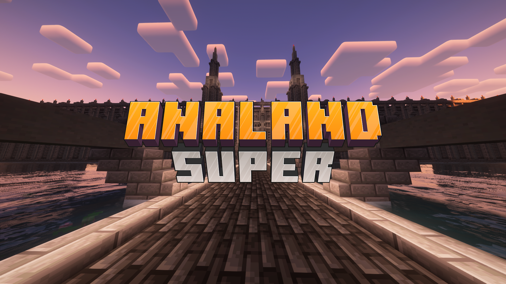

# Analand Super Oficial Web

## Proyecto web "Analand Super" con Python puro y Reflex

> Analand es un servidor de Minecraft Supervivencia con economía, eventos, minijuegos y mucho más. Nos esforzamos para hacer que la experiencia sea inigualable y de calidad.

### Visita [https://analand.net](https://analand.net)

## Front y Back:
[Hosteado con la tecnología de **Pterodactyl**.](https://github.com/Cocotterooo/docker-pterodactyl-reflex)

## Derechos
> [!CAUTION]
> **© Este proyecto es de código abierno, no software libre.**
